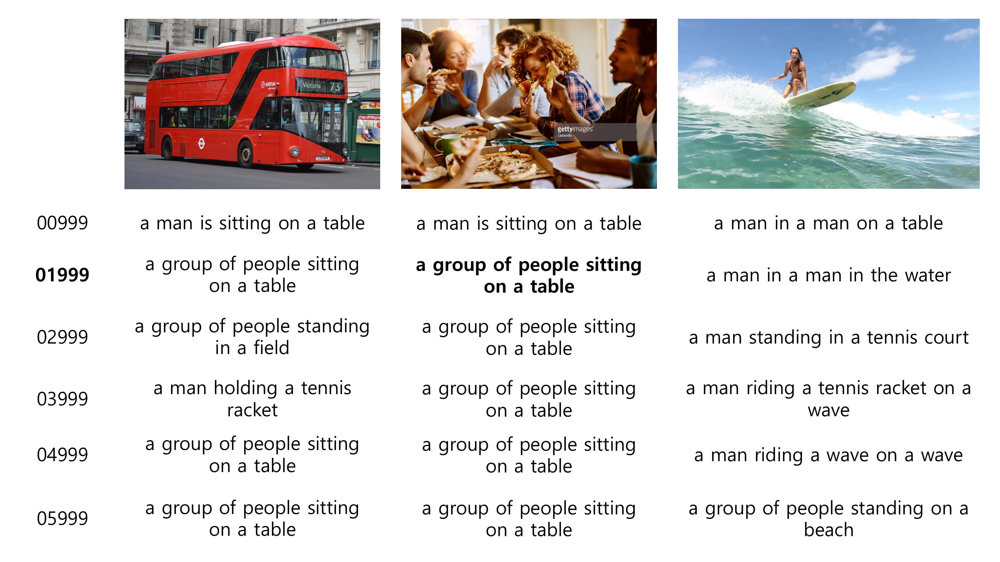
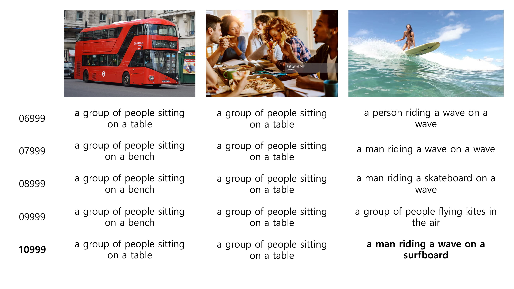

# 2020-1 Image Captioning
- Paper : [Show, Attend and Tell: Neural Image Caption
Generation with Visual Attention](https://arxiv.org/pdf/1502.03044.pdf)
- Source code : [Show, Attend and Tell using Tensorflow](https://github.com/DeepRNN/image_captioning)
- Reference : [Pytorch Tutorial for Image Captioning](https://github.com/sgrvinod/a-PyTorch-Tutorial-to-Image-Captioning)

### Project Description
- Change to python 3 version and how to run (Part 0 ~ 3)
- Understand the basic model of Image Captioning with attention (Part 4)

### Part 0. Develop Environment
- Ubuntu linux 18.04 LTS
- Use conda to install
- python == 3.6
- numpy == 1.16.2
- tensorflow == 1.8
- OpenCV
- Natural Language Toolkit (NLTK)
- Pandas
- Matplotlib
- tqdm

### Part 1. Download data to run
#### 1.1 Download COCO 2014 Train images, 2014 Val images
> 1) Download using COCO website
> - Click [[here]](http://cocodataset.org/#download)
> - Put COCO train2014 images in folder 'train/images'
> - Put COCO val2014 images in folder 'val/images'

> 2) Download using gsutil (Google Storage Utility)
> ~~~
> $ sudo apt install curl  
> $ curl https://sdk.cloud.google.com | bash  
> $ source ~/.bashrc  
> $ cd train  
> $ gsutil -m rsync gs://images.cocodataset.org/train2014 images  
> $ cd ..
> $ cd val
> $ gsutil -m rsync gs://images.cocodataset.org/val2014 images  
> ~~~

#### 1.2 Download COCO 2014 Train/Val annotations
> Download using COCO website
> - Click [[here]](http://cocodataset.org/#download)
> - Put `captions_train2014.json` in folder `train`
> - Put `captions_val2014.json` in folder `val`

#### 1.3 Download pretrained CNN models
> Download using links (select one)
> - Pretrained VGG16 net : [here](https://app.box.com/s/idt5khauxsamcg3y69jz13w6sc6122ph)
> - Pretrained ResNet50 net [here](https://app.box.com/s/17vthb1zl0zeh340m4gaw0luuf2vscne)

#### 1.4 Download punkt
> Go to terminal and open python
> ~~~
> import nltk
> nltk.download('punkt')
> ~~~

### Part 2. Run
#### 2.1 Train using COCO train2014 data
- Setup various parameters in `config.py`
- Train

> Train examples  
>> - Example 2.1.1 Train only RNN part using vgg 16
~~~
$ python main.py --phase=train \
                   --load_cnn=True \
                   --cnn_model_file='./vgg16_no_fc.npy'
~~~
>> - Example 2.1.2 Train both CNN and RNN parts using vgg 16
~~~
$ python main.py --phase=train \
                   --load_cnn=True \
                   --cnn_model_file='./vgg16_no_fc.npy' \
                   --train_cnn=True
~~~
>> - Example 2.1.3 Resume training from checkpoint (train only RNN)
~~~
$ python main.py --phase=train \
                   --load=True \
                   --model_file='./models/xxxxx.npy'\
~~~

> Monitor training progress
~~~
$ tensorboard --logdir='./summary/'
~~~

#### 2.2 Evaluate using COCO val2014 data
- Evaluate

> Evaluate example
>> - Example 2.2.1
~~~
$ python main.py --phase=eval \
                   --model_file='./models/xxxxx.npy'
                   --beam_size=3
~~~

#### 2.3 Test for any JPEG images
- Put images in `test/images`
- Test

> Test example
>> - Example 2.3.1
~~~
$ python main.py --phase=test \
                   --model_file='./models/xxxxx.npy'
                   --beam_size=3
~~~

### Part 3. FAQ
- Train checkpoints will be saved in the folder `models`
- Evaluate result will be shown in stdout and generated captions will be saved in `val/results.json`
- Test generated captions will be saved in the `test/results`
- Examples

### Part 4. Explain about model
This model learns _where_ to look using _Attention_ mechanism, which allows to focus on the part of the image most relevant to the word it is going to use next.
Example for model
---

---

---

---

---

#### 4.1 Key Concepts
##### 4.1.1 Encoder-Decoder architecture
- Encoder : encodes the input image to feature vectors using Convolutional Neural Network (CNN)
- Decoder : generate a caption word by looking at feature vectors and word using Recurrent Neural Network (RNN)
- Example for decoder without attention

##### 4.1.2 Attention
- Attention : make decoder to look at different parts of the image at different points in the sequence
- Example for attention

- Example for decoder with attention

##### 4.1.3 Beam Search
- Algorithm to choose the sequence that has the highest _overall_ score from a basket of candidate sequences

> - Beam Search Algorithm
>> 1. First decode step, consider top `k` candidates  
>> 2. Generate second words for each of `k` first words  
>> 3. Choose top `k` [first + second word] combinations considering additive scores  
>> 4. Generate third words for each of `k` [first + second word] combinations
>> 5. Choose top `k` [first word, second word, third word] combinations considering additive scores  
>> 6. Repeat at each decode step  
>> 7. After `k` sequences terminate, choose the sequence with the best score

